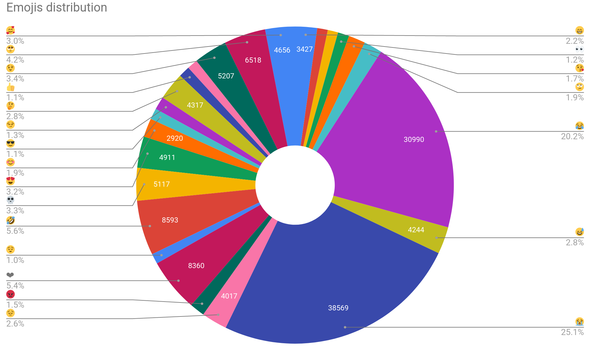

# Fremoji

*Disclaimer*  
This project was a mentored project, led in collaboration with 3 other sutdents.
Out of respect for their work, only my work is disclosed in this repository. As
a result, I do not make the corpus publicly available, since I was not in charge
of its gathering.

## Context

Predicting emojis was a shared task of the SemEval 2018, for Spanish and English.
Emojis can provide useful insights to a user's feeling and their contribution to
sentiment analysis is studied by Felbo et al (2017) or Eisner et al. (2016), to
name of few. Results of the models produced during the SemEval 2018 shared task
achieved an accuracy oscillated between 30 and 40%. The two models in this repo
achieve an accuracy of 33% for the baseline and 36% for the biLSTM.
To the best of our knowledge, in January 2020, no attempt had been made for French.
Thus, the goal of our project was to try and provide a model to do so.

## Getting started

### Requirements

Althought the models can't be trained or evaluated without the corpus,
prediction can be made through command line thanks to demo/*_predict.py.

- streamlit==0.72.0
- tensorflow==2.3.1
- nltk==3.5
- numpy==1.18.5
- pandas==1.1.4
- Keras==2.4.3
- matplotlib==3.3.3
- scikit_learn==0.23.2

### Supported emojis

We were asked to include the 25 most frequent emojis in our corpus as part of
the classification task (see below)

## References

Eisner, B., Rocktäschel, T., Augenstein, I., Bošnjak, M., & Riedel, S. (2016). emoji2vec: Learning emoji representations from their description. arXiv preprint arXiv:1609.08359.

Felbo, B., Mislove, A., Søgaard, A., Rahwan, I., & Lehmann, S. (2017). Using millions of emoji occurrences to learn any-domain representations for detecting sentiment, emotion and sarcasm. arXiv preprint arXiv:1708.00524.